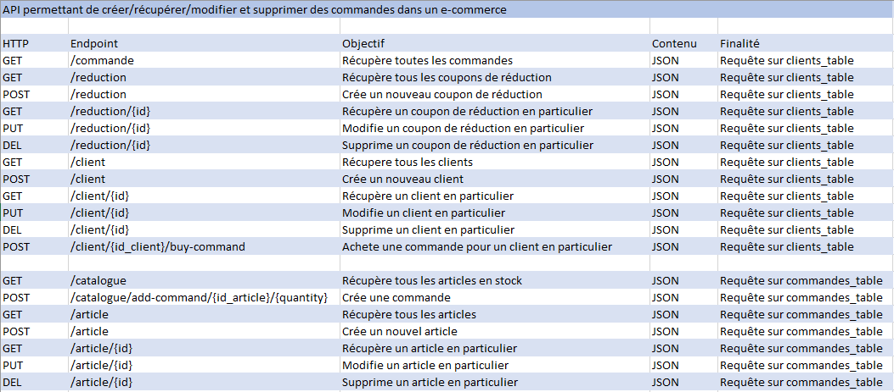
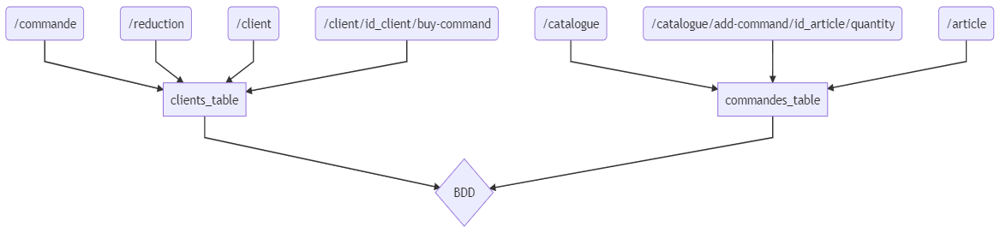

# Cyber Securité

Ce projet consiste à créer une application afin de reperer ses vulnérabilités et développer une surface d'attaque.

# Projet

L'idée est de créer une application sous Spring simulant un commerce de marchandises, avec des clients et un certain nombre de stock, que l'on peut requêter afin de créer un compte ou acheter des marchandises.

# Docker

**Pull l'image**

> $ docker pull mtlantoine/cyber-secu-project:latest

**Run l'image**

> $ docker run --rm -p 5050:8080 mtlantoine/cyber-secu-project:latest

**Résultat**

> $ Aller sur http://localhost:5050/

Une liste des éléments à requeter apparaîtra.

Vous pouvez "GET" les éléments que vous désirez en allant sur les liens suivants :

_GET catalogue_

> http://localhost:5050/catalogue

_GET clients_

> http://localhost:5050/client

_POST créer une commande_

> http://localhost:5050/commande/add-command/_ID-de-l'article-souhaité_/_quantité_

_exemple :_

> http://localhost:5050/commande/add-command/1/50

_GET commandes_

> http://localhost:5050/commande
> Une commande n'existe que si elle a été créée.

_GET articles_

> http://localhost:5050/article

_POST acheter commande_

> http://localhost:5050/client/_ID-du-client-qui-achete_/buy-command

_exemple :_

> http://localhost:5050/client/1/buy-command
> Une commande peut être achetée seulement et seulement si elle a été créée.

_GET stocks_

> http://localhost:5050/stock

_GET reductions_

> http://localhost:5050/reduction

# Tests

**Import the following file in Insomnia/Postman for the tests**

> tests/API_test.json

# Analyse/Vulnérabilités

- L'application n'a pas de service d'authentification, tout le monde pourrai accéder aux commandes de tout le monde, un système comme OAuth 2.0 serait à privilégier pour avoir un bon niveau de sécuritié.

- Il est possible pour un client de récupérer la commande payée par un autre client, un service d'utilisateurs est nécessaire.

- Pour limiter les DOS, on peut limiter la taille maximale du contenu du payload et bloquer un utilisateur pendant un certain temps s'il fait trop de requêtes grâce à express-rate-limit.

# Surface d'attaque

# MermaidJS

# Objectifs de sécurité

**Confidentialité**

La confidentialité consiste à "cadenasser" des informations plus ou moins sensible et qu'il faut proteger.
Par exemple : Un mot de passe, une adresse ou encore un numéro de téléphone.

Dans ce projet, un client ne veut pas que ses commandes et informations privées soient visibles de tous.
Des mots de passes et des gestions de compte doivent être instaurés.
(4/5)

**Intégrité**

L'intégrité consiste à ce qu'une information ne soit pas modifiée frauduleusement.
Par exemple : On ne veut pas que notre mot de passe soit changé par une personne tierse à notre insu.

Dans ce projet, l'idée est de s'assurer qu'une commande d'un client peut être modifiée par lui et seulement lui.
(5/5)

**Disponibilité**

La disponibilité se fait en fonction de l'importance de visibilité d'un élément, et pour qui.
L’importance de la disponibilité d’une information varie suivant les besoins, les moments et peut même varier selon les circonstances.

Dans ce projet, les articles présents en magasin doivent être visible pour tous les clients (et non clients),
les articles en rupture de stocks n'ont pas d'utilité à ce qu'ils soient visibles par qui que ce soit.
Les commandes faites par un client ont plus d'intêret à être visible uniquement pour le client qui l'a créée et pas un autre.
(3/5)

**Traçabilité**

La traçabilité consiste à créer un "historique" de qui est passé sur une application, qui a fait des modifications, où et quand.

Dans ce projet, si une commande a été modifiée à l'insu d'un client, il aimerai savoir quand la modification en question a été réalisée et où afin de se faire une idée de qui aurai pu faire la modification.
(0/5)

# Autheur

Antoine MORTELIER
